# Internship Experience: Accenture - SAP Material Management

## 1. Overview & Objectives
* **Role:** SAP Material Management (MM) Intern
* **Company:** Accenture
* **Duration:** January 27, 2026 – May 29, 2026
* **Core Focus:** SAP end-to-end process | SAP Supply Chain Management (SCM) | Material Management (MM)
* **Setting:** First phase : self-paced learning, Fully online | Second phase : Laptop distribution & specialized track bootcamp, Fully Remote 

---

## 2. Onboarding & Systems Training
### Key Learnings
* Overview of SAP ERP architecture and navigating the SAP GUI.
* Core concepts of Material Management: Organization Structures (Plant, Storage Location, Purchasing Org).

### Phase 1: Self-Paced SAP Foundations (Late Junuary – February)
* **Personal Laptop Setup:** Spent the initial phase from late January through February focusing on foundational knowledge using my personal computer.
* **Self-Paced Learning Modules:** Completed online coursework covering general SAP ERP architectures and end-to-end business processes.
* **Certifications & Badges Progress:** Worked through self-study materials that laid the groundwork for earning preliminary SAP digital badges and course completion milestones provided by Accenture before transitioning to hands-on system configurations thru specialized tracks. *(See full some of the courses in the list in the [Certifications & Badges](#certifications--badges) section below).*

## SAP Learning Platform Taken Courses for Phase 1

  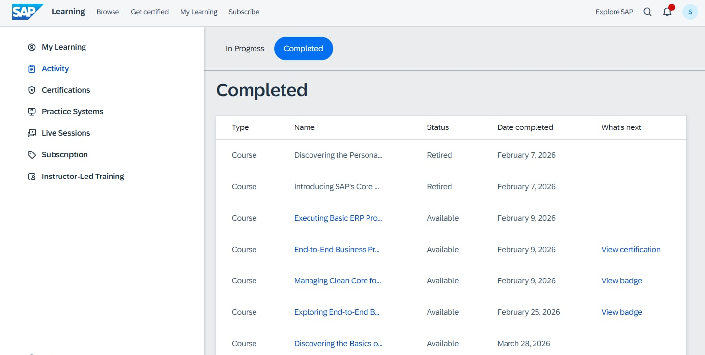  
  <em>SAP Learning modules completion for phase 1</em>

### Laptop Onboarding & Device Compliance Challenges (Early March)
* **Onboarding & Setup:** Joined my UST batchmates during the in-person laptop distribution phase at the BGC office to configure our enterprise devices, security compliances, VPN tools, and the SAP GUI installation.
* **Compliance Issues:** Thru March to May, a major hurdle for many of my fellow delegates was maintaining **device compliance status**. Several friends faced non-compliant status triggers, on which most do not understand how they got such issues.
* **Resolution:** My classmates pushed into raising their concern into team members and local IT support to troubleshoot to clear non-compliant flags to secure full SAP system access. Some cases took days and sometimes a few weeks, which I felt a huge hurdle into completing their weekly designated tasks.

## 📸 Captured Laptop Issues

  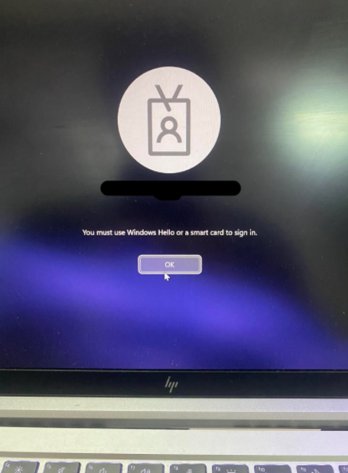
  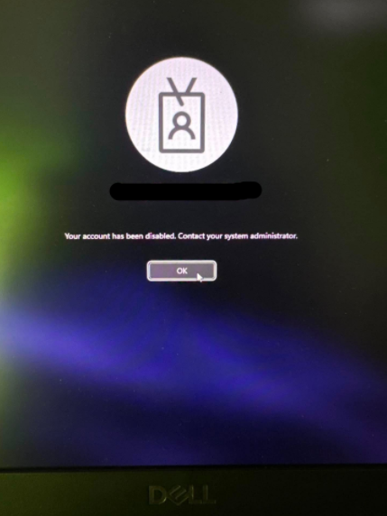
  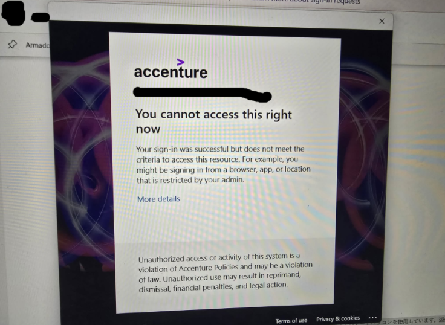 
  <em>Accenture Laptop Setup Issues (Windows Hello, Account Disabled, and Resource Access)</em>

### Personal Reflection
> Personally I did not experience this kind of problem, I do always regularly check my accenture emails regularly weekly (and not get an inactivity status that can possibly lock out the laptop too). Made sure that I do not miss any requirements mentioned by the accenture HRs as well from our mentions before a mentioned deadline.

> Configuration was a matter of following instructions, understand those clear and you can go flow smoothly to complete the config process.

> Almost close to no issues regards to laptop, just that one time I lose my charger in UST library once, and I have to resort to alternatives such as thunderbolt charger that works (charges slowly, but enough voltage to increase the percentage) for weeks then of course I have to buy a charger to avoid lose peripheral fees. I have to go Gilmore to ensure I can buy one, got a deal worth 900 bye money. Thankfully, the new laptop charger was accepted on my returning of laptop, then by then become finally done with the internship with Accenture.

### Phase 2: Specialized SAP MM Track & Remote Bootcamp (March – May)
* **Track Specialization:** Officially transitioned into the specialized SAP Material Management (MM) track, executing real-world enterprise scenarios on our newly configured enterprise laptops.
* **Live Bootcamp Sessions:** Participated in fully remote, mentor-led bootcamp discussions and deep dives focused on procurement workflows, inventory management, and system navigation.
* **Hands-On Configuration:** Applied theoretical knowledge directly in the SAP GUI, practicing core transaction codes and end-to-end supply chain processes under guidance from mentors.

## SAP Learning Platform Taken Courses for Phase 2

  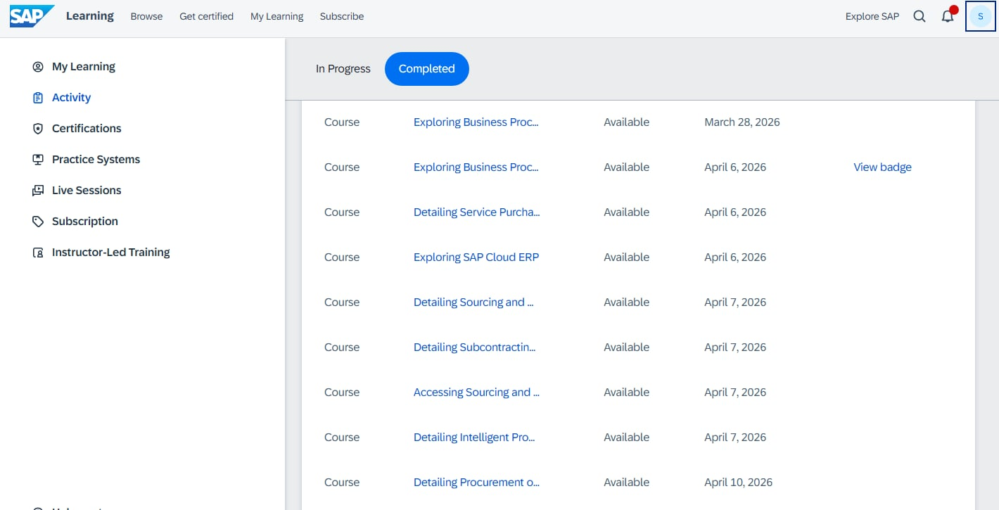  
  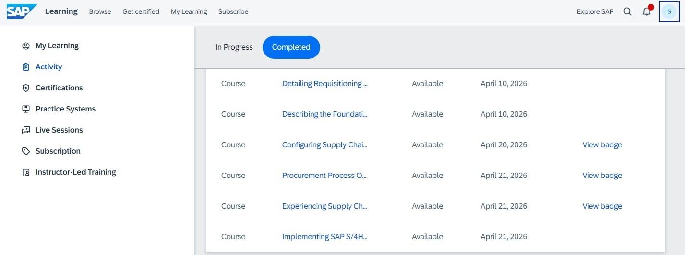  
  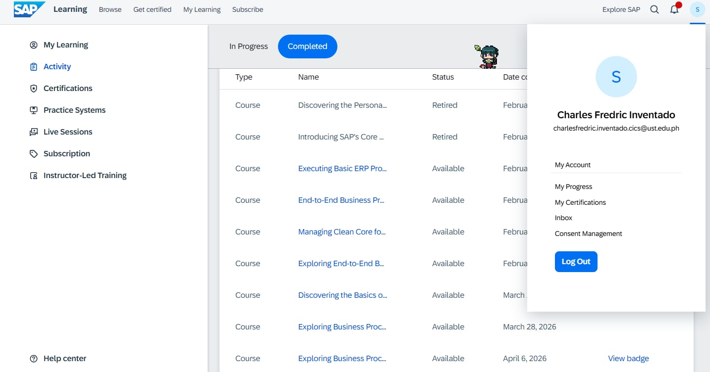  
  <em>SAP Learning modules completion for phase 2</em>

---

## 3. Core Technical Exposure & Tasks
### SAP MM Processes Handled
* **Material Master & Vendor Master Data:** [Describe your experience managing or testing master data]
* **Procurement Cycle:** [Detail work related to Purchase Requisitions, Purchase Orders, and Quotations]
* **Inventory & Invoice Verification:** [Detail work related to Goods Receipt, Goods Issue, or Invoice Matching]

### Challenges Overcome
* [Describe a specific problem or technical issue you faced and how you solved it]

---

## 4. Professional Development & Soft Skills
* **Cross-Team Collaboration:** Working alongside functional consultants and business analysts.
* **Problem-Solving:** How I approached debugging errors or troubleshooting system workflows.
* **Communication:** Presenting updates during daily standups or team syncs.

---

## 5. Major Highlights & Takeaways
* **Biggest Accomplishment:** [e.g., Successfully assisting in unit testing, creating documentation, or automating a task]
* **Key Lessons Learned:** [What you learned about enterprise software, consulting, or personal productivity]

---

## 6. Final Day Presentation (3rd to 4th week of May)

<em>A preview of how the final demo works.</em>

Our final task after completion of self-paced modules as well the bootcamp discussions, we have to live demonstrate to our mentors Sir Bembol and Sir Jemuel the four core basic processes in SAP MM (Purchase Requisition, Purchase Order, Goods Receipt, and Invoice Verification).

Was a little nervous, as I was one of the first ones to do the demo, I was trying my best to remain executing the right processes and commands, and thankfully we persevered hahaha, and what we left was to support my fellow delegates into completing their demos too.

> 📊 **Proof of Execution**  
> Proof of generated SAP transaction IDs here sample:  
> [**Inventado - Demo IDs.xlsx**](https://github.com/ShizueSeira/Accenture---SAP---Material-Management-/blob/main/Inventado%20-%20Demo%20IDs.xlsx)

---

## 📸 Internship Highlights Pics

   
  <em>Matchy with the room color @ Accenture BGC Taguig</em>

 

  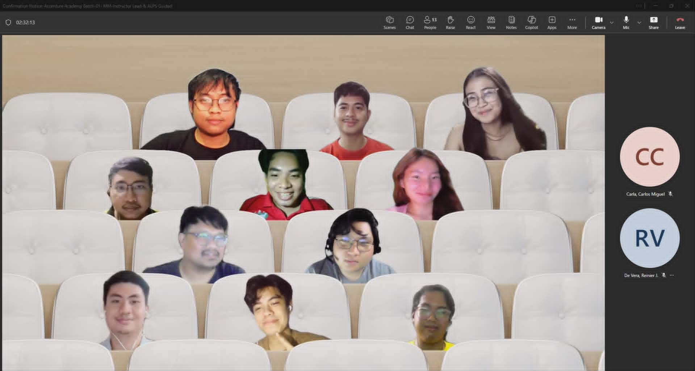 
  <em>Final Day of Bootcamp Pic @ Online</em>

---

## 📸 Random Internship Journey Pics

  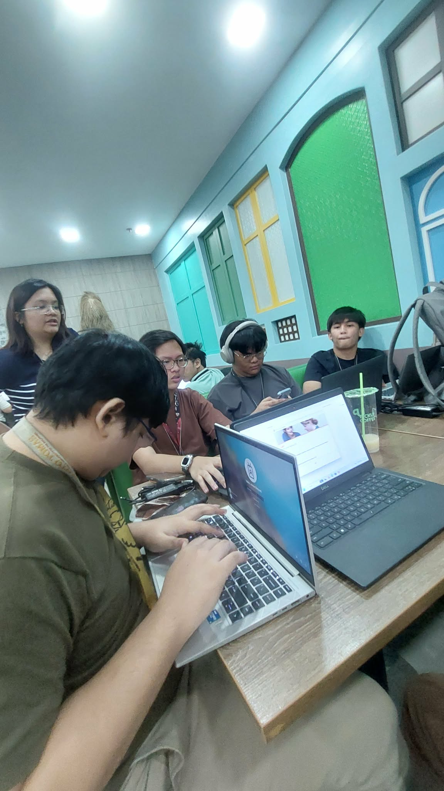 
  <em>Laptop set-up with fellow UST friends</em>

  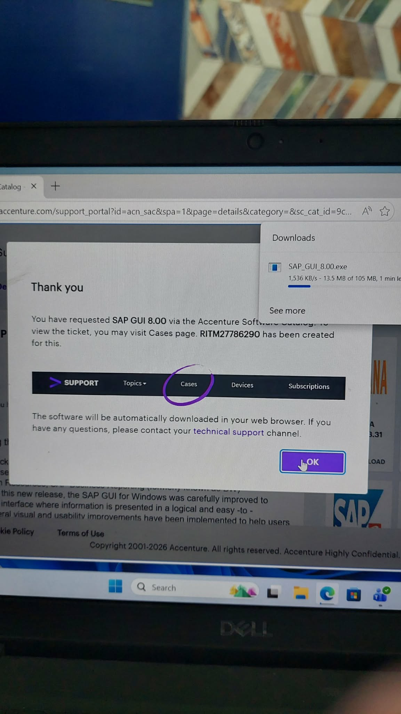 
  <em>Laptop Set-up</em>

  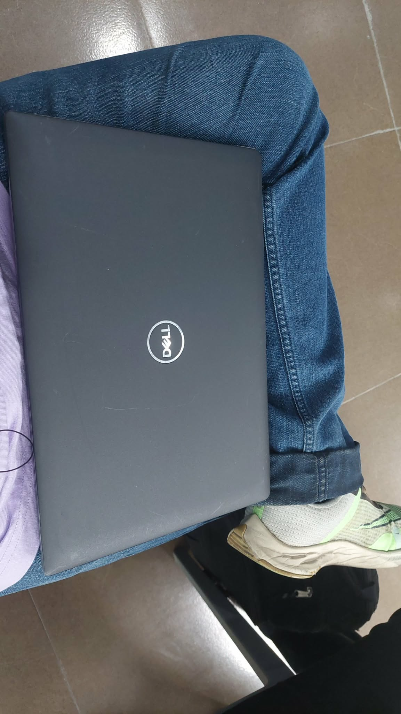 
  <em>Me and my laptop</em>

  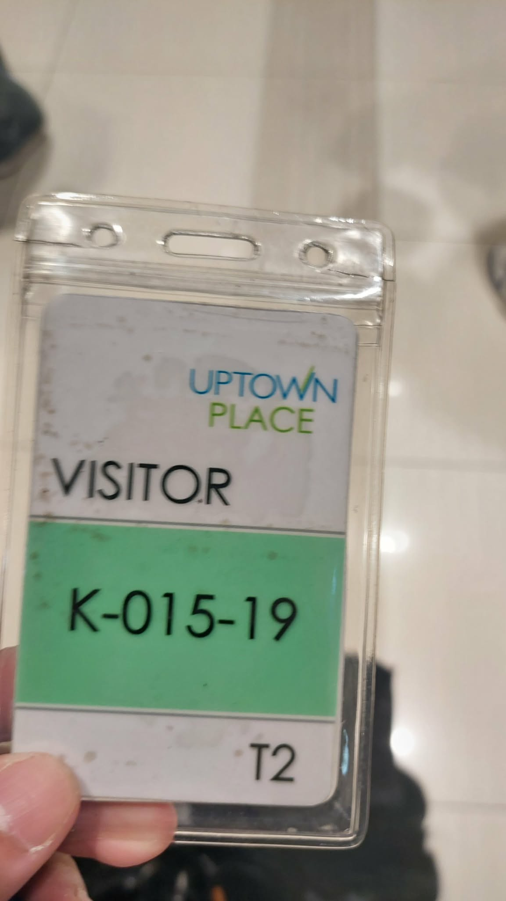 
  <em>We need a visitor pass to enter Accenture floors</em>

---

## Certifications & Badges

### 📜 Professional Certification
* **[SAP Certified - Implementation Consultant - End-to-End Business Processes for SAP Business Suite](https://www.credly.com/badges/b0933ca5-a6ab-4af7-b00d-cab4b005dfe5)** *(Credly Verified)*

---

### 🏅 SAP Digital Badges 
* **[Applying Supply Chain Execution in SAP S/4HANA Cloud Private Edition](https://www.credly.com/badges/5e688eb8-b10a-4d61-9199-af968221a31d)** 
* **[Managing Clean Core for SAP Cloud ERP](https://badger.learning.sap.com/verify/xedog-gagik-haheh-rifym-gicyp)**
* **[Exploring End-to-End Business Processes in SAP Business Suite](https://badger.learning.sap.com/verify/xekop-cecon-nenyg-hyged-tamuc)**
* **[Procurement Process Overview](https://badger.learning.sap.com/verify/xafes-berir-pimid-pytyn-kiluk)**
* **[Configuring Supply Chain Business Scenarios in SAP S/4HANA Cloud Public Edition](https://badger.learning.sap.com/verify/xivep-byrep-gakem-bafyd-vemov)**
* **[Experiencing Supply Chain Business Scenarios in SAP S/4HANA Cloud Public Edition](https://badger.learning.sap.com/verify/xuvom-sigat-furop-pudud-pufuc)**

---

## 📄 Documented Certificates
* **Certificate of Completion:** [Inventado_AccentureTechAcademy__Certificate of Completion](https://github.com/ShizueSeira/Accenture---SAP---Material-Management-/blob/main/Inventado_AccentureTechAcademy__Certificate%20of%20Completion.JPG)
